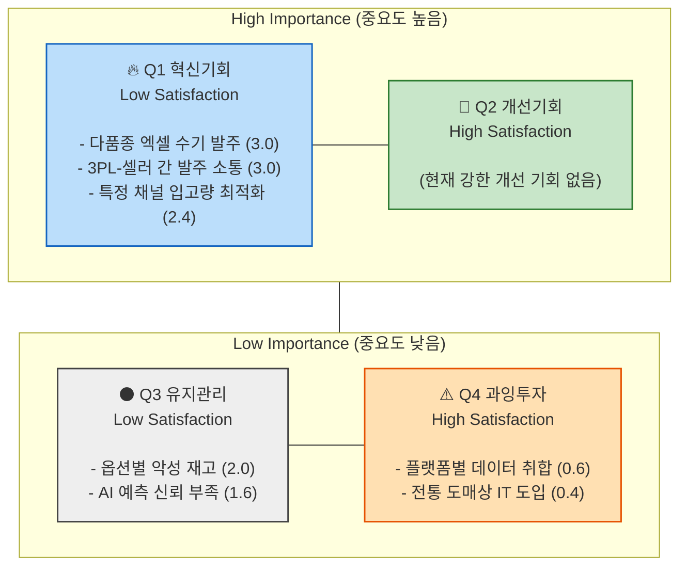

# 기회 점수 (AOS) 기반 시장 접근 전략 매트릭스

[페르소나 스펙트럼](wiki/concepts/business_strategy/saas-persona-spectrum.md) 및 [고객 여정 지도](wiki/concepts/business_strategy/saas-cjm.md)에서 도출된 다양한 Pain Point/Goal을 바탕으로, 우리가 MVP 단계에서 어떤 기능에 집중해야 할지 결정하기 위해 **조정형 기회점수(AOS)** 분석을 수행했습니다.

* **AOS 산출 공식**: `AOS = Importance × (1 - Satisfaction / 5)`

---

## 1. AOS 평가 테이블

핵심 고객 및 확장/비활성 고객들이 겪는 주요 문제점들을 바탕으로 정량적 점수를 매겼습니다.

| Pain / Goal | 관련 페르소나 | Importance (1~5) | Satisfaction (1~5) | AOS 계산식 | 최종 AOS | 전략적 해석 |
| --- | --- | --- | --- | --- | --- | --- |
| **수십 개 SKU의 익일 발주량 수기 계산의 고통** | 이지훈 (자사몰 대표) | 5 | 2 (엑셀 의존) | 5 × (1 - 0.4) | **3.0** | MVP 최우선 혁신 기회 (Q1) |
| **로켓그로스 등 특정 채널 입고량 최적화** | 윤서연 (로켓 셀러) | 4 | 2 (수기 피벗) | 4 × (1 - 0.4) | **2.4** | 부분적 개선 기회 (Q1-Q2 경계) |
| **예측 이유를 알 수 없는 AI에 대한 신뢰 부족** | 한지민 (파워셀러) | 4 | 3 (불안정 자동화) | 4 × (1 - 0.6) | **1.6** | 유지/보완 영역 (Q3) |
| **옵션/사이즈별 악성 재고 발생 위험** | 최민호 (패션 MD) | 5 | 3 (단순 통계툴) | 5 × (1 - 0.6) | **2.0** | 유지/보완 영역 (Q3) |
| **3PL 센터와 셀러 간 발주 타이밍 소통 지연** | 김명식 (물류 소장) | 5 | 2 (카톡, 전화) | 5 × (1 - 0.4) | **3.0** | B2B 확장용 혁신 기회 (Q1) |
| **플랫폼별 파편화된 주문 데이터 취합** | 박소율 (마이크로) | 3 | 4 (사방넷 등) | 3 × (1 - 0.8) | **0.6** | 과잉투자 위험 (Q4) |
| **가입 및 세팅 등 IT 툴 도입의 장벽 극복** | 오영길 (전통 도매) | 2 | 4 (전화/장부) | 2 × (1 - 0.8) | **0.4** | 과잉투자 위험 (Q4) |

---

## 2. AOS 시각화 매트릭스 (Market Approach Strategy)

X축은 '현재 대안에 대한 만족도(Satisfaction)', Y축은 '문제의 중요도(Importance)'입니다. 기준점인 3.0을 중심으로 4분면으로 나뉩니다.

---

## 3. 사분면별 전략적 액션 플랜

### 🔥 Q1. 혁신기회 (MVP 최우선 타겟)
* **전략**: 만족도는 낮고 중요도는 매우 높은 **Unmet Need**입니다. 우리의 초기 MVP가 120% 역량을 쏟아야 할 영역입니다.
* **액션**: 
  1. 복잡한 연동 없이, **'기존 엑셀 파일'을 던져 넣으면 즉시 내일 발주량을 뽑아주는 기능(1-Click Optimizer)**을 코어 기능으로 개발합니다.
  2. B2B 파트너(3PL)를 위한 **'위험 재고 알림(Alert) 카카오톡 연동'** 기능을 설계하여 파트너십 확장을 도모합니다.

### 💎 Q2. 개선기회
* **전략**: 현재 고객들이 어느 정도 대안에 만족하고 있으나, 우리가 더 잘할 수 있는 영역입니다. 초기엔 Q1에 집중하고 차후 경쟁사 대비 우위를 점할 때 활용합니다. (현재 주요 타겟 페인포인트 중에는 없음)

### ⚫ Q3. 유지/보완
* **전략**: 고객들이 불편해하지만 결제에 결정적 영향을 미칠 만큼 급박하지는 않은 문제들입니다.
* **액션**: 'AI 판단 근거(XAI 시각화)'나 '옵션별 딥스케일 분석' 같은 기능은 MVP에는 단순 그래프 정도로만 제공하고, 추후 리텐션을 높이기 위한 Pro 요금제 기능으로 미뤄둡니다.

### ⚠️ Q4. 과잉투자 (버려야 할 영역)
* **전략**: 다른 대체 툴이 이미 잘하고 있거나(사방넷, 플레이오토), 고객의 니즈가 너무 낮은(수기 도매상) 영역입니다.
* **액션**: 
  1. '여러 마켓의 주문을 하나로 모아주는(취합) 기능'은 아예 **포기**합니다. 기존 API 연동이나 엑셀 업로드로 대체합니다.
  2. IT 문맹을 위한 복잡한 노코드 교육 콘텐츠 제작 등도 초기 리소스에서 제외합니다.

## Related
- [비즈니스 전략 프롬프트 라이브러리](wiki/prompts/business-analysis-prompts.md)
- [최우선 페르소나 및 CJM](wiki/concepts/business_strategy/saas-primary-persona.md)
