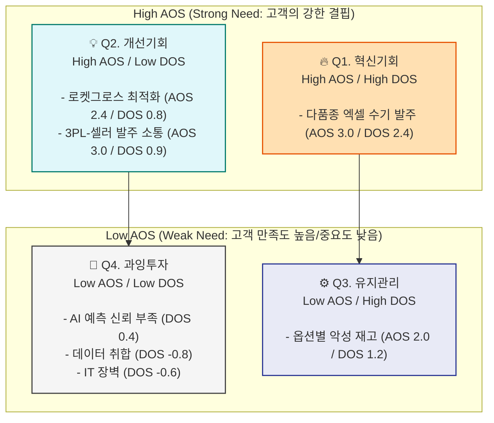

# 기회 점수(DOS) 및 AOS-DOS 비교 매트릭스 분석

[조정형 기회점수(AOS)](wiki/concepts/business_strategy/saas-aos-analysis.md)가 '고객 개인이 느끼는 결핍의 강도'라면, **발견된 기회 점수(DOS, Discovered Opportunity Score)**는 여기에 '시장 규모(TAM%)'를 곱하여 **"실제 시장에서 돈이 될 파급력"**을 계산한 지표입니다. 

* **DOS 산출 공식**: `DOS = (Importance - Satisfaction) × TAM(%)`

## 1. AOS vs DOS 계산 및 평가 테이블

이전 AOS 분석 결과와 [시장 세그먼트 매트릭스](wiki/concepts/business_strategy/saas-tam-sam-som.md)에서 추정한 각 Pain의 시장 비중(TAM%)을 결합하여 분석했습니다.

| Pain / Goal | 관련 페르소나 | Importance | Satisfaction | TAM(%) 추정치 | AOS | DOS | Quadrant | 전략 |
| --- | --- | --- | --- | --- | --- | --- | --- | --- |
| **다품종 엑셀 수기 발주** | 이지훈 (Core) | 5 | 2 | 0.8 (국내 셀러 대다수) | 3.0 | **(5-2)×0.8 = 2.4** | Q1 | 타게팅 1순위 |
| **로켓그로스 등 특정 채널 최적화** | 윤서연 (Core) | 4 | 2 | 0.4 (쿠팡 전용 셀러) | 2.4 | **(4-2)×0.4 = 0.8** | Q2 | 특화 기능(개선대상) |
| **3PL 센터와 셀러 간 소통 지연** | 김명식 (Adjacent) | 5 | 2 | 0.3 (B2B 물류 시장) | 3.0 | **(5-2)×0.3 = 0.9** | Q2 | 특화 파트너십 |
| **옵션/사이즈별 악성 재고 발생** | 최민호 (Core) | 5 | 3 | 0.6 (패션/뷰티 셀러) | 2.0 | **(5-3)×0.6 = 1.2** | Q3 | 보편적 유지관리 |
| **AI 예측 신뢰 부족** | 한지민 (Core) | 4 | 3 | 0.4 (테크 사비 셀러) | 1.6 | **(4-3)×0.4 = 0.4** | Q4 | 보류 (단순 UI 대응) |
| **플랫폼별 파편화된 데이터 취합** | 박소율 (Core) | 3 | 4 | 0.8 (멀티채널 셀러) | 0.6 | **(3-4)×0.8 = -0.8** | Q4 | 완전 배제 |
| **IT 툴 도입 장벽 (가입/세팅)** | 오영길 (Non-user) | 2 | 4 | 0.3 (전통 도매상) | 0.4 | **(2-4)×0.3 = -0.6** | Q4 | 완전 배제 |

---

## 2. AOS-DOS 매트릭스 (Market Impact)

---

## 3. 사분면 기반 액션 플랜 인사이트

* **Q1 (High AOS / High DOS): "타게팅 1순위 (MVP 코어)"**
  * 고객의 고통도 심하고 시장의 파이도 가장 큰 절대적 기회입니다. **"엑셀 수기 발주"**를 해결하는 **1-Click 발주 리포트 생성기**가 GTM(Go-to-Market)의 메인 무기가 되어야 합니다.
  
* **Q2 (High AOS / Low DOS): "특화 솔루션 (Niche Market)"**
  * 고통은 매우 심하나(AOS 높음), 전체 시장(TAM) 대비 비율이 낮습니다. 예를 들어 '3PL 물류 소장'이나 '로켓그로스 전용 셀러'가 이에 해당합니다. 초기 MVP 개발에서는 우선순위가 밀리지만, 차후 **특정 버티컬 타겟용 모듈(Add-on)**로 고가 요금제를 런칭할 때 핵심 무기가 됩니다.

* **Q3 (Low AOS / High DOS): "유지 관리 (Commodity)"**
  * 시장 비중은 크지만, 이미 이알피아 등 대체 툴에 의해 어느 정도 만족하고 있거나 상대적으로 덜 아픈 문제입니다. '옵션/사이즈별 악성 재고 방지' 기능은 런칭 후 경쟁사를 방어하는 **위생 요인(Hygiene Factor)**으로 꾸준히 고도화합니다.

* **Q4 (Low AOS / Low DOS): "과잉투자 방지"**
  * 고객의 니즈도 약하고 시장 가중치도 마이너스에 가깝습니다. '주문 수집(데이터 취합)'이나 'AI 신뢰도 확보를 위한 과도한 머신러닝 학습 과정 공개'는 과감히 **개발 백로그에서 삭제(보류)**합니다.

## Related
- [비즈니스 전략 프롬프트 라이브러리](wiki/prompts/business-analysis-prompts.md)
- [기회점수(AOS) 기반 시장 접근 전략](wiki/concepts/business_strategy/saas-aos-analysis.md)
