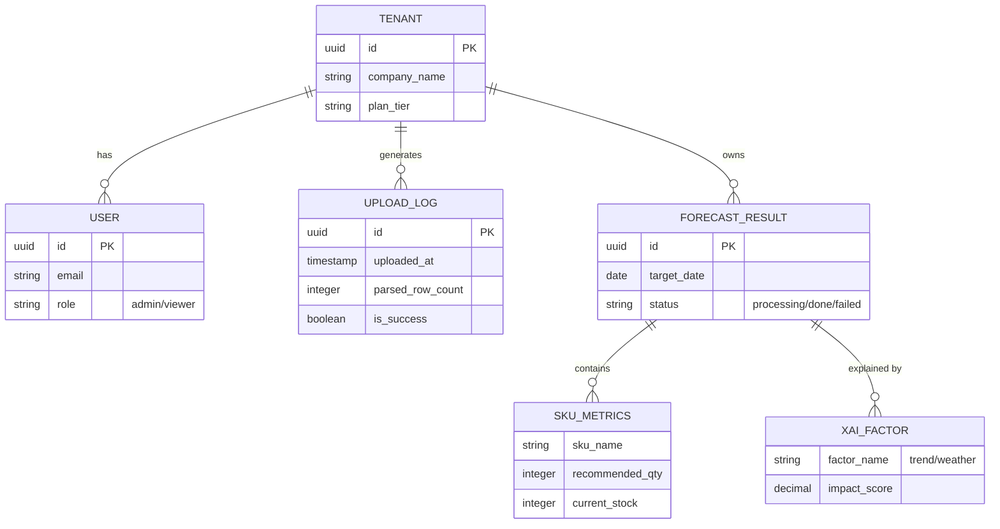
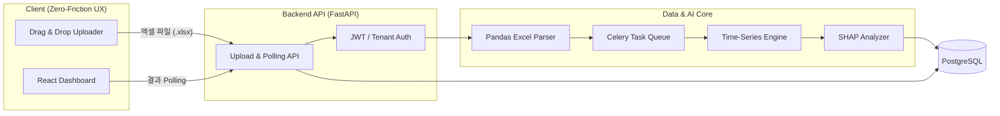

# DeepDemand SaaS PRD v1.0 (Zero-Friction AI 발주 대시보드)
- **Owner 팀**: DeepDemand 기획 및 아키텍처 파트
- **최종 업데이트**: 2026-05-16

---

## 1. 개요·목표

*   **문제 정의**: SME 셀러들이 사방넷/카페24 주문 엑셀을 다운로드 받아 내일 발주량을 수기로 계산하는 데 매일 2시간이 소요되며, 예측 오차로 인해 주 평균 5건의 품절 사태가 발생함 (Pain AOS 3.0).
*   **목표 (Desired Outcome)**: 
    *   초기 세팅(API 연동 등) 없이 엑셀 파일 업로드만으로 1분 내에 AI 기반 발주 추천 리포트 확인.
    *   발주 계산 시간 95% 단축 (2시간 → 5분).
*   **성공 지표 (KPIs)**:
    *   **북극성 KPI**: `주간 엑셀 업로드 유저 비율 (WAU 중 발주 리포트 생성 완료율) ≥ 60%`
    *   **보조 KPI**: `평균 온보딩 Time-to-Value(가입 ~ 첫 리포트 생성 시간) ≤ 3분`, `초기 업로드 중도 이탈률 ≤ 15%`

---

## 2. 사용자와 페르소나

*   **핵심 타겟**: [이지훈 (32세, 연매출 20억 오픈마켓/자사몰 다품종 셀러 대표)](saas-primary-persona.md)
*   **핵심 여정(JTBD)**: "주문 폭주로 기존 엑셀 수식이 꼬여버린 밤(When), 어떤 시스템 연동 설정 없이 쓰던 엑셀 파일만 올려서 당장 내일 아침 넘길 발주 지시서를 뽑고 싶다(I want to)."

---

## 3. 사용자 스토리와 수용 기준(AC, Acceptance Criteria)

### Story 1: 엑셀 드래그 앤 드롭 업로드 및 파싱
**"As a** 바쁜 SME 셀러 **I want** 사방넷 엑셀 파일을 그대로 드래그 앤 드롭하여 **so that** 즉시 발주 데이터를 분석하고 싶다."
*   **AC 1 (정상 케이스)**: Given 메인 대시보드에 로그인한 상태에서 / When 10MB 이하의 .xlsx 주문 파일을 업로드 영역에 드롭하면 / Then 3,000ms 이내에 파싱 성공 모달과 함께 총 로우(Row) 수가 출력되어야 한다.
*   **AC 2 (포맷 오류)**: Given 지원되지 않는 포맷(.pdf, .csv 등)을 올릴 때 / When 업로드를 시도하면 / Then "지원하지 않는 엑셀 형식입니다. (.xlsx만 가능)" 에러 메시지를 1,000ms 내에 붉은색 토스트 팝업으로 노출한다.
*   **AC 3 (데이터 결측 방어)**: Given '옵션명' 또는 '주문수량' 필수 컬럼이 비어있는 엑셀을 올릴 때 / When 업로드하면 / Then "필수 데이터(옵션명)가 누락된 행이 X개 있습니다" 경고를 노출하고 매핑 UI로 유도한다.

### Story 2: 1-Click 발주량 추천 및 XAI 대시보드 (핵심 기능)
**"As a** 재고 불안감이 큰 셀러 **I want** 추천된 발주량의 산출 근거를 차트로 확인하여 **so that** 안심하고 공장에 발주를 넣고 싶다."
*   **AC 1 (결과 렌더링)**: Given 엑셀 파싱이 완료된 후 / When "발주 예측 시작" 버튼을 클릭하면 / Then 10,000ms 이내에 SKU별 내일 발주 추천 수량이 리스트 형태로 렌더링되어야 한다.
*   **AC 2 (XAI 차트)**: Given 추천 리스트에서 특정 SKU 항목을 / When 클릭하여 확장(Accordion)하면 / Then 우측 패널에 최근 14일간의 판매량 스파이크 추이와 추천 근거 텍스트(예: "최근 3일 판매량 200% 증가 기반")가 노출되어야 한다.

---

## 4. 기능 요구사항(Functional) 및 MoSCoW 우선순위

| 구분 | 기능명 | 가치 및 근거 |
| :---: | --- | --- |
| **Must** | **(F1) Zero-Friction 엑셀 업로드/파서** | API 연동의 높은 진입장벽을 부수는 핵심 온보딩. TTV 단축(목표: 3분). |
| **Must** | **(F2) 1-Click 내일 발주 추천 리포트** | 핵심 Job(정확한 수량 역산) 해결. |
| **Should** | **(F3) 예측 근거(XAI) 대시보드** | 고객의 Anxiety(불안감) 통제. |
| **Could** | **(F4) 악성 재고 위험 신호등** | 과발주 방지를 보조하는 체류시간 증대 지표. |
| **Won't** | **(F5) 3PL 물류센터 알림톡 발송** | **[제외 사유]** 초기 SaaS MVP의 핵심 워크플로우를 벗어남. **[재진입 조건]** 1차 기능 안착 후 B2B 엔터프라이즈 티어로 격상 시 재검토. |
| **Won't** | **(F6) 다채널 API 실시간 주문 수집기** | **[제외 사유]** 사방넷/플레이오토가 기점유한 시장(DOS -0.8 매몰비용).  **[재진입 조건]** 영구 제외 판단. |

---

## 5. 비기능 요구사항(NFR, Non-Functional Requirement)

### 5-1. 성능 및 신뢰성 (Performance & Reliability)
*   **성능**: 메인 대시보드 로딩 시간 p95 ≤ `1,500ms`, 엑셀 파일(최대 5MB) 업로드 및 파싱 처리 시간 p95 ≤ `3,000ms`, 발주 예측 연산 시간 p95 ≤ `10,000ms` (로딩 스피너 필수 제공).
*   **신뢰성/가용성**: 월 서비스 가용성(Uptime) ≥ `99.9%`, 파일 파싱 실패율 ≤ `1.0%`.

### 5-2. 보안 및 비용 (Security & Cost)
*   **멀티테넌트 격리 (Multi-Tenant Isolation)**: B2B SaaS 특성상 고객사 간 데이터 교차 노출을 원천 차단하기 위해, 논리적 DB 격리 구조를 취하고 JWT 기반의 엄격한 인가(Authorization) 룰을 적용한다.
*   **엑셀 보안 보장**: 고객이 업로드한 엑셀(Raw Data) 원본은 예측 연산 직후 임시 스토리지 공간에서 **24시간 이내 영구 삭제** 처리한다. (데이터 탈취 불안감 원천 차단).
*   **비용**: 클라우드 인퍼런스 비용 월 1,000명 액티브 사용 기준 $500 이하 유지.

### 5-3. 모니터링 및 온콜(On-Call) 기준
*   **인프라 알럿**: 서버 리소스(CPU/Memory) 80% 이상 5분 지속 시 Slack #dev-alert 경고 발송.
*   **비즈니스 알럿(파이프라인)**: "지원하지 않는 엑셀 형식" 에러가 1시간 내 전체 사용자 대상 20건 이상 발생 시, 엑셀 양식 포맷 변경으로 간주하여 프론트엔드/백엔드 팀장에게 P1 호출(On-call) 발송.

---

## 6. 데이터·인터페이스 개요

### 6-1. 핵심 시스템 엔터티 (ERD)

### 6-2. 기술 아키텍처 개요 다이어그램

### 6-3. 주요 API 제약
*   `POST /api/v1/forecast/upload`: 엑셀 페이로드 최대 `10MB` 제한. Timeout `15s`. 멀티파트 폼 데이터.
*   `GET /api/v1/forecast/{result_id}`: 예측 결과 Polling 처리 (비동기 큐잉 아키텍처 사용).

---

## 7. 범위(In/Out), 리스크·가정·의존성

### 7-1. In/Out Scope
*   **In Scope**: 엑셀(.xlsx) 수동 업로드, 단일 날짜(익일) 발주량 예측, 예측 근거(XAI) 그래프 뷰.
*   **Out Scope**: 타 솔루션 API 토큰 연동을 통한 실시간 수집, 자동 팩스/메일 발주 기능(MVP 기간 내 배제). 결제 연동(베타 기간 무상 제공).

### 7-2. 주요 리스크 (Risk)
*   *Risk 1*: 사방넷/카페24가 엑셀 다운로드 양식(컬럼명)을 예고 없이 변경할 경우 파싱 로직 에러.
    *   *대처*: 정규식을 유연하게 처리하고, 매핑 실패 시 사용자가 수동으로 '상품명', '수량' 컬럼을 지정할 수 있는 UI 컴포넌트(Mapping Wizard) 제공.
*   *Risk 2*: 데이터가 너무 적어 AI 예측이 단순 이동평균치와 차이가 없는 경우 고객 실망.
    *   *대처*: 이력 데이터 부족 시, 규칙 기반(Rule-based) 안전재고 로직으로 Fallback.

### 7-3. 제품 전제 가정 (Assumptions)
*   SME 셀러 페르소나는 하루 1회 이상 쇼핑몰 백오피스에서 엑셀을 내려받아 가공하는 행위(다운로드/업로드)에 익숙하며, 1회 업로드를 번거롭지 않게 여긴다.

### 7-4. 시스템 의존성 (Dependencies)
*   XAI 대시보드(F3)에 그려지는 차트 데이터는 백엔드의 AI 추론 모델 컨테이너에서 반환하는 Feature Importance 배열(배열 응답 지연 시 화면 렌더링 지연)에 완전히 종속된다.

---

## 8. 실험·롤아웃·측정

### 8-1. 롤아웃 로드맵 (Sprint 기반 배포 계획)
*   **Phase 1 — Zero-Friction 기반 구축 (Sprint 1 · 3주)**
    *   목표: 엑셀 파서 및 멀티테넌트 인증 백엔드 구축.
    *   결과물: `POST /upload` API, JWT 인증 모듈, 정규식 기반 엑셀 매핑 엔진 (F1 완료).
*   **Phase 2 — AI 코어 및 XAI 시각화 (Sprint 2 · 3주)**
    *   목표: 예측 모델 연동 및 SHAP 분석기 조립.
    *   결과물: 시계열 예측 큐잉 시스템, XAI 설명 텍스트/차트 API 산출 (F2, F3 코어 완료).
*   **Phase 3 — UI 연동 및 클로즈드 베타 (Sprint 3 · 2주)**
    *   목표: 프론트엔드 대시보드 렌더링 및 사전 신청 셀러(50개사) 대상 베타 오픈.
    *   결과물: React 메인 대시보드 배포, 온보딩 이탈률 분석을 위한 Amplitude 심기.

### 8-2. 파일럿 검증 기준 (A/B Test 및 통계 분석)
| 실험 목적 | 대상 페르소나 | 통계적 실험 설계 (A/B Test / T-Test) | 판정 기준 (Hit Threshold) |
|---|---|---|---|
| **발주 계산 시간 단축 증명** | 이지훈 (SME 대표) | **대응 표본 T-검정 (Paired T-test)** • n = 베타 참여 30개 셀러의 1주일 로그 • 기존 엑셀 수기 시간 vs 솔루션 업로드~확인 시간 | p < 0.05 유의수준에서 작업 시간이 **90% 이상(5분 이내)** 유의미하게 단축됨 입증. |
| **초기 온보딩 마찰 최소화** | 이지훈 (SME 대표) | **Funnel 전환율 분석 (A/B Test)** • 기존 API 연동 UI(대조군) vs Zero-Friction 엑셀 업로드 UI(실험군) | 실험군의 가입 후 **'첫 발주 리포트 조회' 전환율이 대조군 대비 30%p 이상(최소 60% 달성) 우위** 입증. |

### 8-3. 경쟁 대안 대비 벤치마크 (PRD Goal)
*   **초기 세팅 리드타임**: 대형 SCM 구축(최소 2주) vs **DeepDemand(가입 후 1분, 100% 장벽 해소)**
*   **발주 소요 시간**: 수기 계산(일 2시간) vs **DeepDemand(일 5분 이내, 95% 단축)**
*   **품절 손실**: 직감 발주(주 평균 5건) vs **DeepDemand(주 0건 완전 방어)**

---

## 9. 근거(Proof)
*   [SaaS 가치 제안서 (Value Proposition Sheet)](saas-value-proposition-sheet.md)
*   [JTBD 심층 인터뷰 요약 (Job-Story 및 4 Forces 파악)](saas-jtbd-interview.md)
*   [기회점수 시뮬레이션(DOS) 분석 (왜 F6을 버렸는가)](saas-dos-analysis.md)
