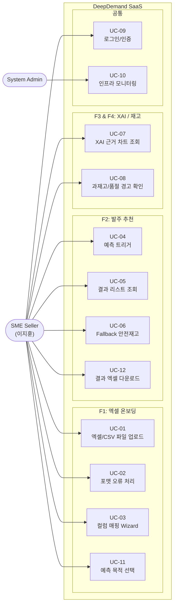
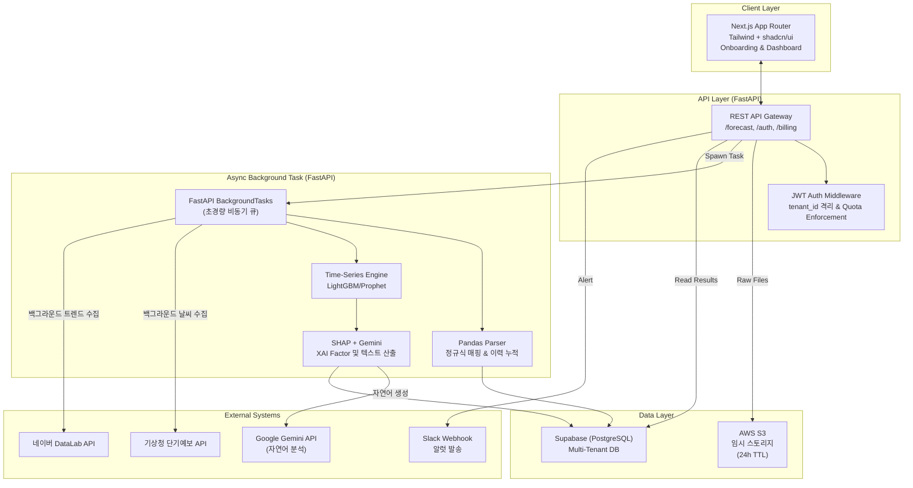
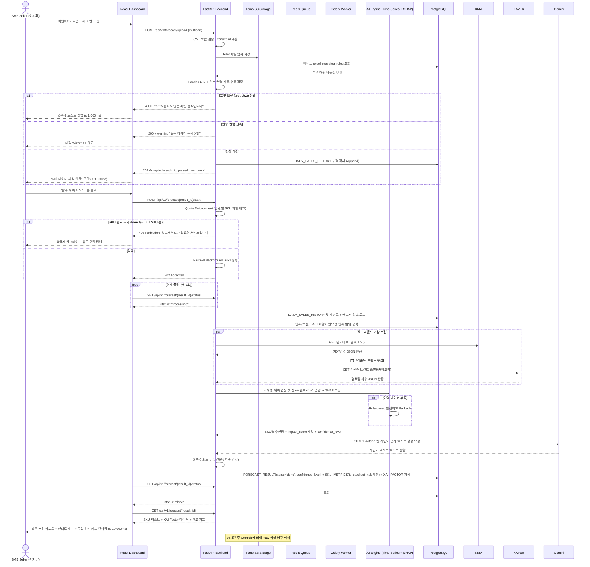
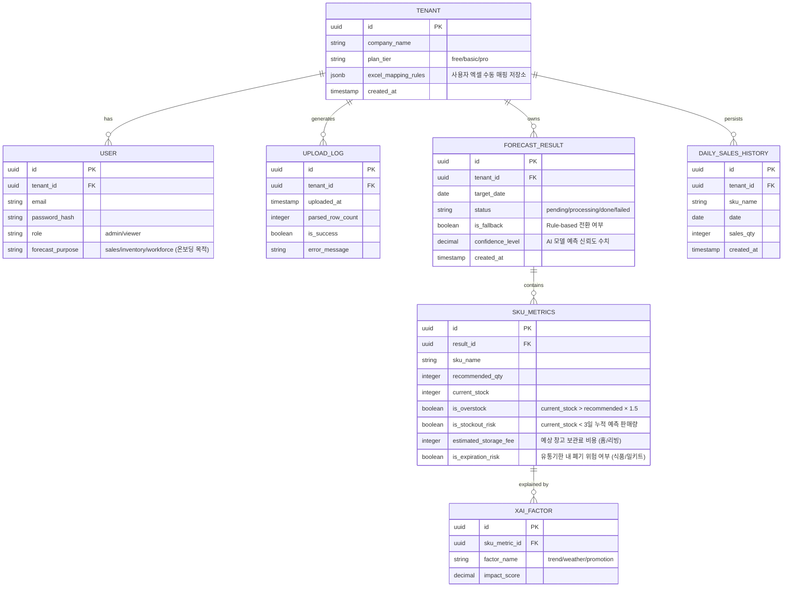
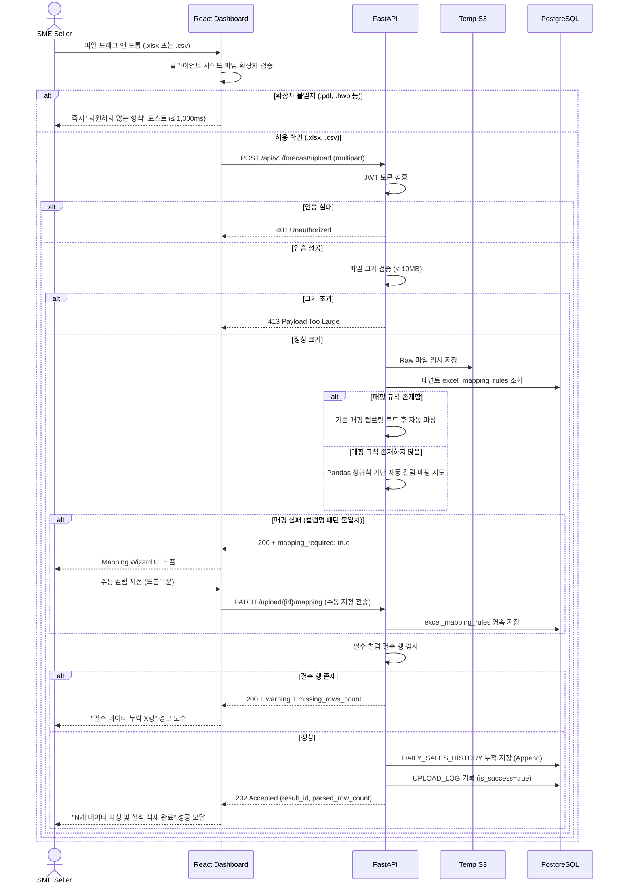
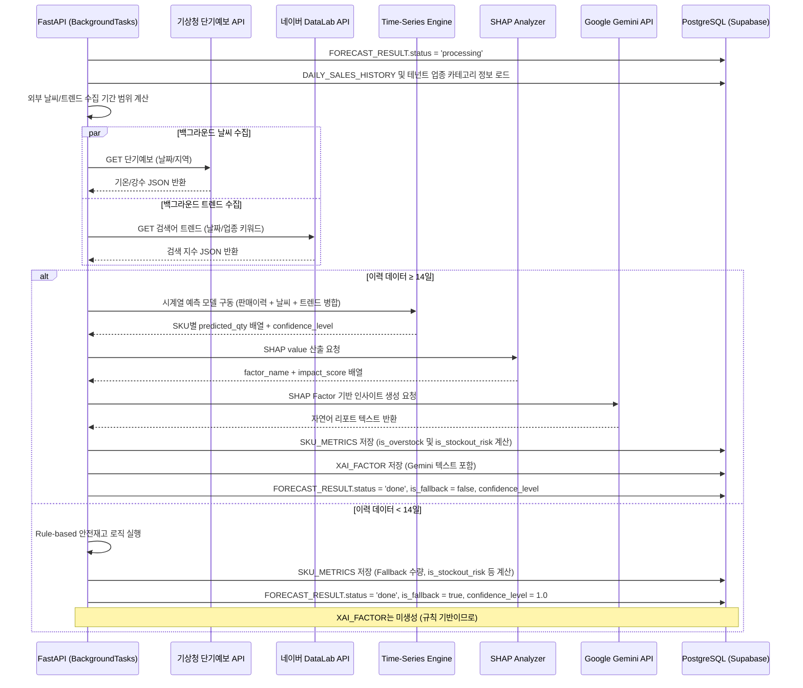

# Software Requirements Specification (SRS)

**Document ID:** SRS-001  
**Revision:** 1.1 (SaaS Pivot Upgrade)  
**Date:** 2026-05-18  
**Standard:** ISO/IEC/IEEE 29148:2018  

---

## 1. Introduction

### 1.1 Purpose

본 SRS는 **DeepDemand SaaS (Zero-Friction AI 발주 대시보드)** 시스템의 소프트웨어 요구사항을 정의한다.

본 시스템은 다음 문제를 해결한다:
> SME 셀러들이 쇼핑몰 백오피스에서 주문 내역을 다운로드받아 내일 발주량을 수기로 계산하는 데 매일 2시간이 소요되며, 예측 오차로 인해 주 평균 5건의 품절 사태가 발생하여 매출 손실 및 고객사 이탈을 겪음 (Pain AOS 3.0).

본 시스템은 API 연동이라는 높은 기술적·심리적 진입장벽을 제거하고, 고객이 기존에 사용하던 판매 실적 파일(.xlsx 및 .csv)을 드래그 앤 드롭하는 것만으로 AI 기반 익일 발주 추천 수량과 그 산출 근거(XAI)를 즉시 시각화하여 보여주는 **Zero-Friction 대시보드**로 작동한다.

본 문서의 대상 독자는 시스템 아키텍트, 백엔드/프론트엔드 엔지니어, 데이터 엔지니어, 데이터 사이언티스트 및 QA 팀이다.

### 1.2 Scope

#### 1.2.1 In-Scope (MVP)

| ID | 항목 | 설명 | PRD 참조 |
|---|---|---|---|
| SCOPE-IN-01 | F1. Zero-Friction 엑셀/CSV 업로드 | API 연동 없이 .xlsx 및 .csv 드래그 앤 드롭만으로 즉시 사용. 정규식 자동 매핑 + 수동 매핑 Wizard | PRD §4 F1, §3 Story 1 |
| SCOPE-IN-02 | F2. 1-Click 내일 발주 추천 리포트 | 누적 판매 실적 이력을 기반으로 시계열 예측 엔진을 통해 SKU별 익일 발주량 역산 | PRD §4 F2, §3 Story 2 |
| SCOPE-IN-03 | F3. 예측 근거(XAI) 대시보드 | SHAP 기반 변수별 기여도 시각화, 14일 추이 차트 및 자연어 근거 텍스트 제공 | PRD §4 F3, §3 Story 2 |
| SCOPE-IN-04 | F4. 악성 재고 및 품절 리스크 경고 | 보유 재고 > 적정 재고 × 1.5 시 과재고 경고, 보유 재고 < 3일 누적 예측 판매량 시 품절 경고 신호등 노출 | PRD §4 F4 |

#### 1.2.2 Out-of-Scope

| ID | 항목 | 배제 사유 | 재진입 조건 | PRD 참조 |
|---|---|---|---|---|
| SCOPE-OUT-01 | F5. 3PL 물류센터 알림톡 발송 | 초기 SaaS MVP 핵심 워크플로우를 벗어남 — **Won't** | B2B 엔터프라이즈 티어 격상 시 재검토 | PRD §4 F5 |
| SCOPE-OUT-02 | F6. 다채널 API 실시간 주문 수집기 | 사방넷/플레이오토가 기점유한 시장 (DOS -0.8 매몰비용) — **Won't** | 영구 제외 판단 | PRD §4 F6 |
| SCOPE-OUT-03 | PG사 자동 결제 고도화 | 초기 베타 기간 무상 Freemium 제공 및 Stripe/Toss API 뼈대만 대기 | MVP 안착 후 유료 요금제 전면 시행 시점 | PRD §7-1 |

#### 1.2.3 Constraints (제약사항)

| ID | 제약사항 | PRD 참조 |
|---|---|---|
| CON-01 | 엑셀/CSV 파싱 및 예측 연산은 긴 소요시간(최대 10초)이 예상되므로 FastAPI의 내장 `BackgroundTasks` 기반 폴링 아키텍처를 채택하여 비동기 인프라(Redis/Celery) 복잡도를 제거한다. | PRD §6-2, §6-3 |
| CON-09 | **(Vibe Coding 최적화)** 프론트엔드는 Next.js(App Router) + Tailwind CSS + shadcn/ui를 사용하여 AI 코드 생성 일관성을 확보한다. | C-TEC-001, 004 |
| CON-10 | **(Vibe Coding 최적화)** 데이터베이스는 로컬 개발 시 SQLite, 배포 시 Supabase(PostgreSQL)를 사용하여 인프라 설정 복잡도를 제거한다. | C-TEC-003 |
| CON-11 | **(Vibe Coding 최적화)** 수치 연산(LightGBM/Prophet)은 Python 백엔드가 전담하며, XAI 근거 자연어 리포트 생성 역할만 Google Gemini API를 가볍게 호출하여 위임하는 하이브리드 LLM 연동을 수행한다. | C-TEC-006 |
| CON-02 | 업로드된 엑셀/CSV 원본 파일은 예측 연산 직후 임시 스토리지에서 **24시간 이내 영구 삭제**해야 한다 (Cronjob). | PRD §5-2 |
| CON-03 | 고객사(Tenant) 간 데이터 교차 노출 원천 차단을 위해 논리적 DB 격리 + JWT 기반 엄격한 인가(RBAC)를 적용한다. | PRD §5-2 |
| CON-04 | XAI 대시보드(F3) 차트 데이터는 백엔드 AI 추론 모델의 Feature Importance 배열 반환에 완전 종속된다. | PRD §7-4 |
| CON-05 | 사방넷/카페24가 엑셀 컬럼명을 예고 없이 변경할 수 있으므로, 파싱 실패 시 수동 컬럼 매핑 UI(Mapping Wizard) 제공이 필수다. | PRD §7-2 Risk 1 |
| CON-06 | 이력 데이터 부족 시 AI 예측이 단순 이동평균과 동등해질 수 있으므로, 규칙 기반(Rule-based) 안전재고 Fallback 로직을 반드시 구현한다. | PRD §7-2 Risk 2 |
| CON-07 | Freemium 가격 정책(Free/Basic/Pro)에 따라 테넌트 등급별 SKU 수 및 예측 한도를 제한한다 (Free: 1 SKU, Basic: 100 SKU, Pro: 무제한). | pivot-strategy §2.4 |
| CON-08 | 날씨/트렌드 외부 변수는 SME 유저의 업로드 허들을 없애기 위해, 사용자가 올린 엑셀 데이터의 날짜와 테넌트 기본 정보를 기준으로 백그라운드 배치 파이프라인에서 자동 수집 및 결합한다. | pivot-strategy §2.1 |

#### 1.2.4 Assumptions (가정)

| ID | 가정 | PRD 참조 |
|---|---|---|
| ASM-01 | SME 셀러는 하루 1회 이상 쇼핑몰 백오피스에서 엑셀을 내려받아 가공하는 행위에 익숙하며, 1회 업로드를 번거롭지 않게 여긴다. | PRD §7-3 |

### 1.3 Definitions, Acronyms, Abbreviations

| 용어 | 정의 | PRD 참조 |
|---|---|---|
| **JTBD (Jobs to be Done)** | 사용자가 특정 상황에서 달성하고자 하는 핵심 과업 | PRD §2 |
| **XAI (Explainable AI)** | 인공지능 예측의 근거를 인간이 이해 가능한 형태(차트, 텍스트)로 설명하는 시스템 | PRD §3 Story 2 |
| **SHAP (SHapley Additive exPlanations)** | 개별 예측에 대한 변수별 기여도를 산출하는 XAI 기법 | PRD §6-2 |
| **TTV (Time-To-Value)** | 고객이 제품 사용 후 최초의 핵심 가치를 느끼기까지 걸리는 시간. 목표: ≤ 3분 | PRD §1 |
| **Zero-Friction** | 별도 API 통합이나 복잡한 설정 없이, 기존 파일 업로드만으로 핵심 기능을 즉시 사용 가능한 상태 | PRD §1, §4 F1 |
| **Multi-Tenancy** | 단일 인프라에서 복수 고객의 데이터를 논리적으로 격리하여 운영하는 구조 | PRD §5-2 |
| **AOS (Adjusted Opportunity Score)** | 고객 체감 중심의 미충족 기회점수 (기회 탐색용) | PRD §2 |
| **DOS (Discovered Opportunity Score)** | 시장 가중 중심의 발견 기회점수 (확장성 검증용) | PRD §2 |
| **MoSCoW** | Must / Should / Could / Won't 우선순위 분류 체계 | PRD §4 |
| **PLG (Product-Led Growth)** | 제품 자체가 마케팅·세일즈·온보딩을 주도하는 성장 전략 | PRD §1 |

### 1.4 References

| ID | 문서 / 출처 | 설명 |
|---|---|---|
| **REF-01** | PRD v1.1 (2026-05-16) | 본 SRS의 원천 문서 (Product Requirements Document) |
| **REF-02** | ISO/IEC/IEEE 29148:2018 | Systems and software engineering — Requirements engineering |
| **REF-03** | SaaS 가치 제안서 (Value Proposition Sheet) | 솔루션 핵심 가치 및 경쟁 대안 벤치마크 근거 |
| **REF-04** | JTBD 심층 인터뷰 요약 (Job-Story 및 4 Forces) | 페르소나 이지훈의 전환 사건 및 핵심 Job 도출 근거 |
| **REF-05** | 기회점수 시뮬레이션(DOS) 분석 | F6(다채널 API 수집기) 영구 제외 판단 근거 (DOS -0.8) |

---

## 2. Stakeholders & Users

| ID | 스테이크홀더 / 액터 | 페르소나 매핑 | 역할 | 핵심 가치 및 요구사항 | 출처 |
|---|---|---|---|---|---|
| STK-01 | SME Seller (End User) | 이지훈 (32세, 연매출 20억 다품종 셀러 대표) | 엑셀 데이터 업로드, 발주 추천 리스트 확인 및 최종 발주 지시 | ① 복잡한 설정 없이 엑셀 한 번으로 내일 발주량 파악 ② 예측 근거의 투명한 제공으로 품절/과발주 Anxiety 해소 ③ TTV ≤ 3분 달성 | PRD §2 |
| STK-02 | System Admin | — | 서비스 인프라 가용성 유지보수, 테넌트 상태 관리, 장애 대응 | ① 장애 징후 시 Slack 경고 즉시 수신 ② 인프라 비용 월 $500 이하 유지 ③ 월 Uptime ≥ 99.9% | PRD §5-1, §5-3 |
| STK-03 | AI/Data Engineer | — | 시계열 예측 모델 및 XAI(SHAP) 모듈 성능 고도화, 엑셀 데이터 결측/오염 시 정규화 로직 관리 | ① 예측 정확도(MAPE) 유지 ② Fallback 로직 정상 작동 보장 ③ Feature Importance 배열 안정적 반환 | PRD §6-2, §7-2 |

---

## 3. System Context and Interfaces

### 3.1 External Systems

| ID | 시스템 | 유형 | 설명 | PRD 참조 |
|---|---|---|---|---|
| EXT-01 | AWS S3 (임시 스토리지) | Infrastructure | 업로드된 엑셀/CSV Raw 파일 임시 저장. 24시간 내 Cronjob으로 영구 삭제 | PRD §5-2 |
| EXT-02 | Slack Webhook | Outbound | 인프라 알럿(CPU/MEM 80%↑) 및 비즈니스 알럿(파싱 에러 급증) 발송 채널 | PRD §5-3 |
| EXT-04 | 기상청 단기예보 API | Inbound | 백그라운드로 날짜별 기온·강수 데이터를 자동 수집하여 예측 엔진 피처로 결합 | raw/SRS-V1.0 §3.1 |
| EXT-05 | 네이버 DataLab 트렌드 API | Inbound | 백그라운드로 업종/상품 카테고리 검색어 트렌드 지수를 자동 수집하여 피처로 결합 | raw/SRS-V1.0 §3.1 |

### 3.2 Technology Stack (기술 스택)

| ID | 클라이언트/서버 | 기술 스택 | 설명 |
|---|---|---|---|
| STK-01 | 프론트엔드 (UI) | Next.js (App Router), Tailwind CSS, shadcn/ui | 엑셀/CSV 드래그 앤 드롭 업로드, 온보딩 Wizard, 발주 추천 리포트 렌더링 |
| STK-02 | 배포 및 호스팅 | Vercel (Front), Render/Railway (Backend) | Git Push 기반의 자동화된 CI/CD 배포 및 서버리스 호스팅 |

### 3.3 Use Case Overview

#### Use Case — Requirement 매핑

| UC ID | 유스케이스 명 | 관련 액터 | 관련 REQ |
|---|---|---|---|
| UC-01 | 엑셀/CSV 파일 업로드 | SME Seller | REQ-FUNC-001, 002, 006, 016, 017 |
| UC-02 | 포맷 오류 처리 | SME Seller | REQ-FUNC-003 |
| UC-03 | 컬럼 매핑 Wizard | SME Seller | REQ-FUNC-004, 005 |
| UC-04 | 예측 트리거 | SME Seller | REQ-FUNC-007, 011, 018, 023 |
| UC-05 | 결과 리스트 조회 | SME Seller | REQ-FUNC-008, 010, 020 |
| UC-06 | Fallback 안전재고 | SME Seller | REQ-FUNC-009 |
| UC-07 | XAI 근거 차트 조회 | SME Seller | REQ-FUNC-012, 013 |
| UC-08 | 과재고/품절 경고 확인 | SME Seller | REQ-FUNC-014, 021 |
| UC-09 | 로그인/인증 | SME Seller | REQ-FUNC-015 |
| UC-10 | 인프라 모니터링 | System Admin | REQ-NF-010, 011 |
| UC-11 | 예측 목적 선택 | SME Seller | REQ-FUNC-022 |
| UC-12 | 결과 엑셀 다운로드 | SME Seller | REQ-FUNC-019 |

### 3.4 Component Architecture

### 3.5 API Overview

| ID | API 명 | 메서드 | 엔드포인트 | 설명 | PRD 참조 |
|---|---|---|---|---|---|
| API-01 | 로그인/토큰 발급 | POST | `/api/v1/auth/login` | JWT 액세스 토큰 반환 | PRD §5-2 |
| API-02 | 엑셀/CSV 업로드 및 파싱 | POST | `/api/v1/forecast/upload` | multipart/form-data. Max 10MB, .xlsx 및 .csv 지원. Timeout 15s. | PRD §6-3, pivot §2.1 |
| API-03 | 예측 트리거 | POST | `/api/v1/forecast/{result_id}/start` | Celery Task Queue에 예측 연산 비동기 할당 (플랜 SKU Quota 검증) | PRD §6-3, pivot §2.4 |
| API-04 | 상태 폴링 | GET | `/api/v1/forecast/{result_id}/status` | 반환: `pending/processing/done/failed` | PRD §6-3 |
| API-05 | 예측 결과 조회 | GET | `/api/v1/forecast/{result_id}` | 완료된 SKU별 추천량, 품절위험, XAI Factor 객체 반환 | PRD §6-3, pivot §2.3 |
| API-06 | 예측 결과 다운로드 | GET | `/api/v1/forecast/{result_id}/export` | 예측 결과를 3PL/도매처 전송용 발주 파일(Excel/CSV)로 다운로드 | pivot-strategy §2.3 |
| API-07 | 결제 세션 생성 | POST | `/api/v1/billing/checkout` | Stripe/Toss Payments 결제 세션 URL 생성 (Freemium 확장 대비) | pivot-strategy §2.4 |
| API-08 | 결제 승인 웹훅 | POST | `/api/v1/billing/webhook` | 외부 PG사 결제 완료 웹훅 처리 및 테넌트 플랜 승격 | pivot-strategy §2.4 |

### 3.6 Interaction Sequences (핵심 시퀀스 다이어그램)

#### 3.6.1 엑셀 업로드 → 비동기 예측 → 결과 폴링 흐름

---

## 4. Specific Requirements

### 4.1 Functional Requirements

#### 4.1.1 F1 — Zero-Friction 엑셀/CSV 업로드 (Must)

| ID | 요구사항 | Source | Priority | Acceptance Criteria |
|---|---|---|---|---|
| **REQ-FUNC-001** | 시스템은 사용자가 대시보드에서 .xlsx 및 .csv 파일을 드래그 앤 드롭으로 업로드할 수 있는 UI를 제공해야 한다. | Story 1, F1 | Must | **Given** 로그인 상태의 대시보드에서 **When** 10MB 이하의 .xlsx 또는 .csv 파일을 업로드 영역에 드롭하면 **Then** 업로드 요청이 `POST /api/v1/forecast/upload`로 전송된다. |
| **REQ-FUNC-002** | 시스템은 업로드된 파일을 Pandas 기반으로 파싱하여 총 행(Row) 수를 산출하고 성공 모달을 표시해야 한다. | Story 1 AC 1 | Must | **Given** 정상 파일 업로드 시 **When** 파싱이 완료되면 **Then** p95 ≤ 3,000ms 내에 파싱 성공 모달과 총 Row 수가 출력된다. |
| **REQ-FUNC-003** | 시스템은 지원하지 않는 파일 포맷(.pdf, .hwp 등) 업로드 시 에러 메시지를 반환해야 한다. | Story 1 AC 2 | Must | **Given** .pdf 또는 .hwp 파일 업로드 시 **When** 업로드를 시도하면 **Then** 1,000ms 내에 "지원하지 않는 파일 형식입니다. (.xlsx, .csv만 가능)" 에러를 붉은색 토스트 팝업으로 노출한다. |
| **REQ-FUNC-004** | 시스템은 필수 컬럼('옵션명/상품명', '주문수량/판매량')이 비어있는 행을 감지하여 경고를 표시하고 매핑 UI로 유도해야 한다. | Story 1 AC 3 | Must | **Given** 필수 컬럼이 누락된 엑셀/CSV 업로드 시 **When** 파싱 수행하면 **Then** "필수 데이터가 누락된 행이 X개 있습니다" 경고를 노출하고 수동 컬럼 매핑 Wizard UI로 유도한다. |
| **REQ-FUNC-005** | 시스템은 정규식 기반으로 엑셀/CSV 컬럼을 자동 매핑하되, 매핑 실패 시 사용자가 수동으로 컬럼을 지정할 수 있는 Mapping Wizard UI를 제공하고, 해당 규칙을 테넌트 정보(excel_mapping_rules)에 영속 저장하여 다음 업로드 시 자동 적용해야 한다. | F1, CON-05, pivot §2.1 | Must | **Given** 컬럼명이 기존 패턴과 불일치할 때 **When** 수동으로 매핑을 완료하면 **Then** 해당 매핑 규칙이 저장되고 다음 업로드부터 자동으로 매핑이 수행된다. |
| **REQ-FUNC-006** | 시스템은 업로드된 엑셀/CSV Raw 파일을 임시 스토리지(S3)에 저장하고, 24시간 이내에 Cronjob으로 영구 삭제해야 한다. | CON-02, PRD §5-2 | Must | **Given** 파일이 S3에 저장된 상태에서 **When** 24시간이 경과하면 **Then** Cronjob이 해당 파일을 영구 삭제하고 삭제 로그를 기록한다. |
| **REQ-FUNC-017** | 시스템은 업로드된 판매 데이터의 파싱이 완료되면 중복을 방지하여 일별 판매 실적을 DAILY_SALES_HISTORY 엔터티에 누적 적재(Append)해야 한다. | pivot-strategy §2.1 | Must | **Given** 정상 파싱이 완료되었을 때 **When** DB 적재 단계가 시작되면 **Then** DAILY_SALES_HISTORY 테이블에 기존 실적과 중복되지 않게 일별 판매 실적이 누적 저장된다. |
| **REQ-FUNC-022** | 시스템은 최초 온보딩 단계에서 사용자로부터 예측 목적(매출 추이 / 재고 부족 / 필요 인력)을 선택받는 온보딩 Wizard UI를 제공하고, 선택 목적에 따라 대시보드 레이아웃과 노출 위젯을 동적으로 분기 구성해야 한다. | pivot-strategy §2.2 | Must | **Given** 신규 회원가입 및 최초 로그인 시 **When** 목적 선택 스텝(Step 1)을 완료하면 **Then** 해당 목적 정보(`forecast_purpose`)가 저장되고, 대시보드 메인 뷰가 해당 목적에 맞게 맞춤형 레이아웃으로 렌더링된다. |

#### 4.1.2 F2 — 1-Click 내일 발주 추천 리포트 (Must)

| ID | 요구사항 | Source | Priority | Acceptance Criteria |
|---|---|---|---|---|
| **REQ-FUNC-007** | 사용자가 "발주 예측 시작" 버튼 클릭 시, 시스템은 FastAPI 내장 BackgroundTasks를 활용해 비동기로 예측 작업을 실행해야 한다 (Redis/Celery 배제). | Story 2, F2, CON-01 | Must | **Given** 파싱 완료 후 **When** "발주 예측 시작" 버튼 클릭 시 **Then** `POST /api/v1/forecast/{result_id}/start`가 호출되고 백그라운드 연산이 트리거되며 202 Accepted가 즉시 반환된다. |
| **REQ-FUNC-008** | 시스템은 시계열 예측 모델을 기반으로 SKU별 익일 발주 추천 수량을 산출하여 DB에 저장해야 한다. | Story 2 AC 1, F2 | Must | **Given** 예측 Task가 Worker에 할당된 후 **When** AI 연산이 완료되면 **Then** SKU_METRICS.recommended_qty가 FORECAST_RESULT(status='done')와 함께 DB에 저장된다. |
| **REQ-FUNC-009** | 시스템은 이력 데이터가 부족하여 AI 예측이 무의미할 경우, 규칙 기반(Rule-based) 안전재고 로직으로 Fallback해야 한다. | CON-06, PRD §7-2 | Must | **Given** 업로드 데이터의 이력이 14일 미만일 때 **When** 예측 모델이 실행되면 **Then** Rule-based Fallback 로직으로 전환하고 결과에 "규칙 기반 추정" 플래그를 표기한다. |
| **REQ-FUNC-010** | 시스템은 예측 결과를 SKU별 리스트 형태로 대시보드에 렌더링해야 한다. | Story 2 AC 1 | Must | **Given** FORECAST_RESULT.status='done' 상태에서 **When** 프론트엔드가 결과를 조회하면 **Then** p95 ≤ 10,000ms 내에 SKU별 추천 수량이 리스트로 렌더링된다. |
| **REQ-FUNC-011** | 시스템은 예측 진행 중 상태를 폴링 API로 제공하고, 프론트엔드는 로딩 스피너를 표시해야 한다. | F2, CON-01 | Must | **Given** 예측 작업이 processing 상태일 때 **When** 프론트엔드가 2초 간격으로 `GET /status`를 호출하면 **Then** 현재 상태(pending/processing/done/failed)가 반환되고 UI에 로딩 스피너가 표시된다. |
| **REQ-FUNC-018** | 시스템은 비동기 예측 연산 시, 해당 판매 이력 기간과 테넌트 정보(카테고리/지역)를 기반으로 백그라운드 배치 파이프라인에서 기상청 단기예보 및 네이버 DataLab API를 자동 수집하고 피처로 병합해야 한다. | CON-08, raw §6.3 | Must | **Given** Celery Worker가 추론 데이터를 로드할 때 **When** 외부 API 호출 기간을 분석하여 데이터를 수집하면 **Then** 기온/강수 및 카테고리 검색 지수가 AI 모델 인풋 변수로 자동 병합된다. |
| **REQ-FUNC-019** | 시스템은 대시보드에 시각화된 추천 수량 및 발주 물량 결과를 도매상이나 3PL 송부용으로 깔끔하게 포맷팅된 Excel/CSV 파일로 1-Click 다운로드할 수 있는 기능을 제공해야 한다. | pivot-strategy §2.3 | Must | **Given** 발주 추천 대시보드가 로드되었을 때 **When** '발주 파일 다운로드' 버튼을 누르면 **Then** p95 ≤ 1,000ms 내에 1-Click 내보내기 API가 가동되어 파일 다운로드가 완료된다. |
| **REQ-FUNC-023** | 시스템은 업로드 및 예측 트리거 요청 시, 테넌트의 구독 플랜 등급(plan_tier)에 따른 허용 SKU 수 및 일간 예측 횟수를 검증하여 한도 초과 시 요청을 즉각 차단하고 403 Forbidden을 반환해야 한다. | CON-07, pivot §2.4 | Must | **Given** 테넌트 플랜이 'Free' 등급일 때 **When** 업로드된 데이터가 1개 초과의 SKU를 포함하여 예측 트리거를 시도하면 **Then** 403 Forbidden 에러와 함께 플랜 업그레이드 모달을 노출한다. |

#### 4.1.3 F3 — 예측 근거(XAI) 대시보드 (Should)

| ID | 요구사항 | Source | Priority | Acceptance Criteria |
|---|---|---|---|---|
| **REQ-FUNC-012** | 시스템은 예측 결과에 대해 SHAP 기반 변수별 기여도(impact_score)를 산출하여 XAI_FACTOR에 저장해야 한다. | Story 2, F3 | Should | **Given** 예측 모델이 추천량을 산출한 후 **When** SHAP Analyzer가 실행되면 **Then** factor_name별 impact_score가 XAI_FACTOR 엔터티에 저장된다. |
| **REQ-FUNC-013** | 사용자가 추천 리스트에서 특정 SKU를 클릭 시, 최근 14일 판매량 추이 차트와 추천 근거 텍스트를 우측 패널에 노출해야 한다. | Story 2 AC 2, F3 | Should | **Given** 발주 추천 리스트가 렌더링된 상태에서 **When** 특정 SKU 항목을 클릭하면 **Then** 우측 패널에 ① 14일간 판매량 추이 차트와 ② 자연어 기반 추천 근거 텍스트(예: "최근 3일 판매량 200% 급증 기반")가 노출된다. |
| **REQ-FUNC-020** | 시스템은 예측 완료된 결과의 AI 신뢰도(confidence_level)가 70% 미만일 경우 대시보드 화면 상단에 경고 카드(Alert Card)를 노출하여 사용자의 수동 점검을 권고해야 한다. | raw/SRS-V1.0 §4.1.1 | Should | **Given** AI 모델의 신뢰도 수치가 0.70 미만으로 도출될 때 **When** 대시보드 결과 화면이 로드되면 **Then** 대시보드 상단에 황색 경고 카드 및 "주의: AI 예측 신뢰도가 다소 낮습니다. 수동 검토 권장" 배너가 상단에 노출된다. |

#### 4.1.4 F4 — 악성 재고 및 품절 리스크 경고 (Could)

| ID | 요구사항 | Source | Priority | Acceptance Criteria |
|---|---|---|---|---|
| **REQ-FUNC-014** | 시스템은 보유 재고가 적정 재고의 1.5배를 초과하는 SKU에 대해 과재고 경고 아이콘을 발주 리스트에 노출해야 한다. | F4 | Could | **Given** 예측 리스트 렌더링 시 **When** SKU_METRICS.current_stock > recommended_qty × 1.5일 경우 **Then** 해당 SKU 옆에 붉은색 '과재고 경고' 아이콘을 노출한다. |
| **REQ-FUNC-021** | 시스템은 보유 재고가 향후 3일간의 누적 예측 판매량보다 작을 경우, 해당 SKU에 대해 품절 임박 경고(Stockout Alert)를 대시보드 최상단 요약 알림창 및 리스트에 적색 신호등으로 직관적으로 노출해야 한다. | pivot-strategy §2.3 | Should | **Given** 예측 완료 시 **When** current_stock < 3일 누적 예측 판매량일 때 **Then** 해당 SKU 옆에 '품절 경고' 적색 신호등을 노출하고, 메인 요약 영역에 "품절 위험 품목 X개" 알림을 표시한다. |

#### 4.1.5 공통 — 인증 및 멀티테넌트

| ID | 요구사항 | Source | Priority | Acceptance Criteria |
|---|---|---|---|---|
| **REQ-FUNC-015** | 시스템은 사용자 인증에 JWT 토큰을 사용하고, 모든 API 요청에서 tenant_id 기반 Row-Level Isolation을 강제해야 한다. | PRD §5-2, CON-03 | Must | **Given** 1:N 테넌트 환경에서 **When** 테넌트 A의 JWT로 API 호출 시 **Then** WHERE tenant_id=A 필터가 자동 적용되어 타 테넌트 데이터 접근이 불가하다. |
| **REQ-FUNC-016** | 시스템은 UPLOAD_LOG 엔터티에 모든 업로드 이벤트(시각, 성공/실패, 파싱 Row 수)를 기록해야 한다. | PRD §6-1 | Must | **Given** 파일 업로드 시도 시 **When** 파싱이 완료(성공 또는 실패)되면 **Then** UPLOAD_LOG에 uploaded_at, is_success, parsed_row_count가 기록된다. |

---

### 4.2 Non-Functional Requirements

#### 4.2.1 성능 (Performance)

| ID | 요구사항 | 임계치 | 측정 방법 | PRD 참조 |
|---|---|---|---|---|
| **REQ-NF-001** | 메인 대시보드 초기 로딩 속도 | p95 ≤ 1,500ms | RUM (Real User Monitoring) | PRD §5-1 |
| **REQ-NF-002** | 파일(최대 5MB) 업로드 및 파싱 처리 속도 | p95 ≤ 3,000ms | APM 대시보드 | PRD §5-1, Story 1 AC 1 |
| **REQ-NF-003** | 발주 예측 연산 시간 (로딩 스피너 필수 제공) | p95 ≤ 10,000ms | 모델 서빙 로그 | PRD §5-1, Story 2 AC 1 |
| **REQ-NF-004** | 포맷 오류 에러 메시지 반환 속도 | ≤ 1,000ms | APM 대시보드 | Story 1 AC 2 |

#### 4.2.2 가용성 및 신뢰성 (Availability & Reliability)

| ID | 요구사항 | 임계치 | PRD 참조 |
|---|---|---|---|
| **REQ-NF-005** | 월 서비스 가용성 (SLA Uptime) | ≥ 99.9% | PRD §5-1 |
| **REQ-NF-006** | 파일 파싱 실패율 | ≤ 1.0% | PRD §5-1 |

#### 4.2.3 보안 (Security)

| ID | 요구사항 | 상세 | PRD 참조 |
|---|---|---|---|
| **REQ-NF-007** | 멀티테넌트 데이터 격리 | 논리적 DB 격리 (tenant_id 기반 Row-Level Isolation) + JWT RBAC 인가. 교차 노출 사고 절대 금지 | PRD §5-2 |
| **REQ-NF-008** | 업로드 파일 Raw Data 자동 파기 | S3 임시 스토리지 내 업로드 원본을 24시간 이내 Cronjob으로 영구 삭제 | PRD §5-2 |

#### 4.2.4 비용 (Cost)

| ID | 요구사항 | 임계치 | PRD 참조 |
|---|---|---|---|
| **REQ-NF-009** | 클라우드 인퍼런스 인프라 비용 | 월 1,000명 액티브 사용 기준 $500 이하 유지 | PRD §5-2 |

#### 4.2.5 모니터링 및 운영 (Monitoring & Operations)

| ID | 모니터링 대상 | 알림 기준 | 대응 | PRD 참조 |
|---|---|---|---|---|
| **REQ-NF-010** | 인프라 리소스 (CPU/Memory) | 80% 이상 5분 지속 시 | Slack #dev-alert 경고 발송 | PRD §5-3 |
| **REQ-NF-011** | 비즈니스 파이프라인 (엑셀 포맷 에러) | "지원하지 않는 파일 형식" 에러 1시간 내 전체 사용자 대상 20건↑ | 프론트/백엔드 팀장에게 P1 On-call 발송 (엑셀 양식 포맷 변경 의심) | PRD §5-3 |

#### 4.2.6 비즈니스 KPI (선행/후행 지표)

| ID | 지표 | 목표값 | 측정 도구 | PRD 참조 |
|---|---|---|---|---|
| **REQ-NF-012** | 북극성 KPI: 주간 엑셀 업로드 유저 비율 (WAU 중 발주 리포트 생성 완료율) | ≥ 60% | Amplitude | PRD §1 |
| **REQ-NF-013** | 평균 온보딩 TTV (가입 → 첫 리포트 생성) | ≤ 3분 | Amplitude Funnel | PRD §1 |
| **REQ-NF-014** | 초기 업로드 중도 이탈률 | ≤ 15% | Amplitude Funnel | PRD §1 |
| **REQ-NF-015** | 발주 계산 시간 단축 (수기 대비) | 95% 단축 (2시간 → 5분) | Paired T-test (베타 30개사) | PRD §8-2 |
| **REQ-NF-016** | 초기 세팅 리드타임 (대형 SCM 대비) | 가입 후 ≤ 1분 | Amplitude Funnel | PRD §8-3 |
| **REQ-NF-017** | 품절 건수 (직감 발주 대비) | 주 0건 완전 방어 | 고객 피드백 / PoC 로그 | PRD §8-3 |

---

## 5. Traceability Matrix

### 5.1 Story ↔ Requirement ID ↔ Test Case ID

| Source (PRD Story / Feature) | REQ ID | 요구사항 요약 | Test Case ID | 검증 유형 (TIAD) |
|---|---|---|---|---|
| **Story 1** (엑셀 업로드) | REQ-FUNC-001 | 파일 드래그 앤 드롭 업로드 UI | TC-F01 | T |
| Story 1 AC 1 | REQ-FUNC-002 | 파싱 성공 모달 + Row 수 출력 (≤3,000ms) | TC-F02 | T |
| Story 1 AC 2 | REQ-FUNC-003 | 포맷 오류 에러 토스트 (≤1,000ms) | TC-F03 | T |
| Story 1 AC 3 | REQ-FUNC-004 | 필수 컬럼 결측 경고 + 매핑 UI 유도 | TC-F04 | T |
| F1, CON-05, pivot-strategy | REQ-FUNC-005 | 정규식 자동 매핑 + 매핑 규칙 영속 저장 | TC-F05 | D |
| CON-02 | REQ-FUNC-006 | S3 Raw 파일 24h 영구 삭제 Cronjob | TC-F06 | T |
| pivot-strategy | REQ-FUNC-017 | 판매 이력 DAILY_SALES_HISTORY 누적 적재 | TC-F17 | T |
| pivot-strategy | REQ-FUNC-022 | 최초 온보딩 예측 목적 선택 및 대시보드 레이아웃 분기 | TC-F22 | D |
| **Story 2** (발주 추천), F2 | REQ-FUNC-007 | 비동기 Celery Task 큐잉 트리거 | TC-F07 | T |
| Story 2 AC 1, F2 | REQ-FUNC-008 | SKU별 익일 추천량 DB 저장 | TC-F08 | T |
| CON-06 | REQ-FUNC-009 | 이력 부족 시 Rule-based Fallback | TC-F09 | T |
| Story 2 AC 1 | REQ-FUNC-010 | SKU 리스트 대시보드 렌더링 (≤10,000ms) | TC-F10 | T |
| F2, CON-01 | REQ-FUNC-011 | 폴링 API + 로딩 스피너 표시 | TC-F11 | D |
| pivot-strategy | REQ-FUNC-018 | 백그라운드 외부 기상/트렌드 자동 결합 수집 | TC-F18 | T |
| pivot-strategy | REQ-FUNC-019 | 1-Click Excel/CSV 발주 파일 내보내기 | TC-F19 | T |
| pivot-strategy | REQ-FUNC-023 | 구독 요금제 플랜 등급별 SKU 사용량 차단 | TC-F23 | T |
| **Story 2**, F3 | REQ-FUNC-012 | SHAP 기여도 산출 → XAI_FACTOR 저장 | TC-F12 | T |
| Story 2 AC 2, F3 | REQ-FUNC-013 | SKU 클릭 시 14일 추이 + 근거 텍스트 | TC-F13 | D |
| raw/SRS-V1.0 | REQ-FUNC-020 | AI 신뢰도 70% 미만 대시보드 상단 경고 | TC-F20 | T |
| F4 | REQ-FUNC-014 | 과재고 경고 아이콘 노출 (×1.5 초과 시) | TC-F14 | T |
| pivot-strategy | REQ-FUNC-021 | 3일 내 품절 임박 SKU 적색 신호등 알림 | TC-F21 | T |
| PRD §5-2 | REQ-FUNC-015 | JWT + tenant_id Row-Level Isolation | TC-F15 | T |
| PRD §6-1 | REQ-FUNC-016 | UPLOAD_LOG 이벤트 기록 | TC-F16 | T |

### 5.2 NFR Verification Matrix

| REQ ID | 요구사항 | 검증 유형 | 검증 방법 | TC ID |
|---|---|---|---|---|
| REQ-NF-001 | 대시보드 로딩 p95 ≤ 1,500ms | T | k6/Locust 부하 테스트 + RUM 수집 | TC-N01 |
| REQ-NF-002 | 파싱 처리 p95 ≤ 3,000ms | T | 5MB 파일 100회 반복 업로드 벤치마크 | TC-N02 |
| REQ-NF-003 | 예측 연산 p95 ≤ 10,000ms | T | 모델 서빙 벤치마크 (배치 50건) | TC-N03 |
| REQ-NF-004 | 에러 반환 ≤ 1,000ms | T | 잘못된 포맷 파일 반복 업로드 테스트 | TC-N04 |
| REQ-NF-005 | 월 Uptime ≥ 99.9% | A | 30일간 CloudWatch 가용성 로그 분석 | TC-N05 |
| REQ-NF-006 | 파일 파싱 실패율 ≤ 1.0% | A | 30일간 UPLOAD_LOG 성공/실패 비율 분석 | TC-N06 |
| REQ-NF-007 | 멀티테넌트 격리 | I | 토큰 변조를 통한 타 테넌트 접근 불가 코드 리뷰 + 침투 테스트 | TC-N07 |
| REQ-NF-008 | 24h 내 Raw 파기 | T | S3 파일 업로드 후 25시간 경과 후 존재 여부 확인 | TC-N08 |
| REQ-NF-009 | 인프라 비용 ≤ $50/월 | A | AWS/Supabase/Vercel/Render 통합 월간 리포트 분석 (초경량 아키텍처 기준) | TC-N09 |
| REQ-NF-010 | CPU/MEM 80%↑ 5분 → Slack 알럿 | D | 임의 부하 주입 후 Slack 알림 수신 시연 | TC-N10 |
| REQ-NF-011 | 포맷 에러 20건/h → P1 On-call | D | 에러 시뮬레이션 후 On-call 트리거 시연 | TC-N11 |
| REQ-NF-012 | WAU 리포트 완료율 ≥ 60% | A | Amplitude 이벤트 퍼널 분석 (베타 21일) | TC-N12 |
| REQ-NF-013 | TTV ≤ 3분 | A | Amplitude 가입→첫 리포트 시간차 분석 | TC-N13 |
| REQ-NF-014 | 업로드 이탈률 ≤ 15% | A | Amplitude 퍼널 드롭오프 분석 | TC-N14 |
| REQ-NF-015 | 작업 시간 95% 단축 | A | Paired T-test (베타 30개사, p < 0.05) | TC-N15 |
| REQ-NF-016 | 초기 세팅 리드타임 ≤ 1분 | D | 신규 테넌트 온보딩 → 첫 리포트 시연 | TC-N16 |
| REQ-NF-017 | 품절 주 0건 | A | PoC 21일간 품절 건수 추적 | TC-N17 |

> **커버리지:** REQ-FUNC-001~023 (23건) + REQ-NF-001~017 (17건) = **전 40건 TC 할당 완료.**

---

## 6. Appendix

### 6.1 API Endpoint List (상세)

| ID | 메서드 | 엔드포인트 | 인증 | Request | Response | 제약 | 관련 REQ |
|---|---|---|---|---|---|---|---|
| API-01 | POST | `/api/v1/auth/login` | — | `{email, password}` | `{access_token, token_type}` | — | REQ-FUNC-015 |
| API-02 | POST | `/api/v1/forecast/upload` | JWT | `file` (multipart) | `{result_id, parsed_row_count, status}` | Max 10MB, .xlsx 및 .csv 전용, Timeout 15s | REQ-FUNC-001~006 |
| API-03 | POST | `/api/v1/forecast/{result_id}/start` | JWT | — | `{result_id, status: "processing"}` | plan_tier에 따른 Quota 검증 작동 | REQ-FUNC-007, 023 |
| API-04 | GET | `/api/v1/forecast/{result_id}/status` | JWT | — | `{result_id, status}` | 폴링 간격 권장 2s | REQ-FUNC-011 |
| API-05 | GET | `/api/v1/forecast/{result_id}` | JWT | — | `{forecasts: [{sku, recommended_qty, current_stock, is_overstock, is_stockout_risk, estimated_storage_fee, is_expiration_risk, factors:[]}]}` | tenant_id 검증 필수 (버티컬 특화 속성 반영) | REQ-FUNC-008~014, 020, 021 |
| API-06 | GET | `/api/v1/forecast/{result_id}/export` | JWT | — | `Binary File Stream` | 3PL/도매처 포맷팅 파일 다운로드 | REQ-FUNC-019 |
| API-07 | POST | `/api/v1/billing/checkout` | JWT | `{plan_tier}` | `{checkout_url}` | Toss/Stripe 연동용 세션 생성 | pivot §2.4 |
| API-08 | POST | `/api/v1/billing/webhook` | — | `{event, payload}` | `{status: "ok"}` | 결제 완료 테넌트 승격 | pivot §2.4 |

### 6.2 Entity & Data Model

#### 6.2.1 ERD (Entity-Relationship Diagram)

#### 6.2.2 엔터티 상세 정의

| Entity | PK | Attributes | Relations | 관련 REQ |
|---|---|---|---|---|
| **TENANT** | `id` (UUID) | company_name, plan_tier, excel_mapping_rules, created_at | 1:N USER, UPLOAD_LOG, FORECAST_RESULT, DAILY_SALES_HISTORY | REQ-FUNC-005, 015, 023 |
| **USER** | `id` (UUID) | tenant_id(FK), email, password_hash, role, forecast_purpose | N:1 TENANT | REQ-FUNC-015, 022 |
| **DAILY_SALES_HISTORY** | `id` (UUID) | tenant_id(FK), sku_name, date, sales_qty, created_at | N:1 TENANT | REQ-FUNC-017 |
| **UPLOAD_LOG** | `id` (UUID) | tenant_id(FK), uploaded_at, parsed_row_count, is_success, error_message | N:1 TENANT | REQ-FUNC-016, REQ-NF-006 |
| **FORECAST_RESULT** | `id` (UUID) | tenant_id(FK), target_date, status, is_fallback, confidence_level, created_at | N:1 TENANT, 1:N SKU_METRICS | REQ-FUNC-007~011, 020 |
| **SKU_METRICS** | `id` (UUID) | result_id(FK), sku_name, recommended_qty, current_stock, is_overstock, is_stockout_risk, estimated_storage_fee, is_expiration_risk | N:1 FORECAST_RESULT, 1:N XAI_FACTOR | REQ-FUNC-008, 010, 014, 021 |
| **XAI_FACTOR** | `id` (UUID) | sku_metric_id(FK), factor_name, impact_score | N:1 SKU_METRICS | REQ-FUNC-012, 013 |

### 6.3 Detailed Interaction Models (상세 시퀀스 다이어그램)

#### 6.3.1 엑셀/CSV 업로드 파싱 상세 흐름 (예외 처리 포함)

#### 6.3.2 비동기 예측 연산 + Fallback 상세 흐름 (외부 API 수집 포함)

### 6.4 Validation Plan (검증 계획)

> PRD §8 실험·롤아웃·측정에서 도출된 파일럿 검증 기준.

| 실험 ID | 실험 목적 | 대상 | 통계적 설계 | 판정 기준 | 관련 REQ |
|---|---|---|---|---|---|
| **EXP-01** | 발주 계산 시간 단축 증명 | 베타 30개 셀러 | **Paired T-test** (기존 수기 vs 솔루션, 1주일 로그) | p < 0.05에서 작업 시간 **90% 이상 단축** (5분 이내) 유의미 입증 | REQ-NF-015 |
| **EXP-02** | 초기 온보딩 마찰 최소화 | 베타 셀러 | **Funnel A/B Test** (API 연동 UI vs 엑셀/CSV 업로드 UI) | 실험군의 '첫 발주 리포트 조회' 전환율이 대조군 대비 **30%p↑** (최소 60% 달성) | REQ-NF-012, 013, 014 |

---

*(End of Document — SRS-001 Rev 1.1)*
